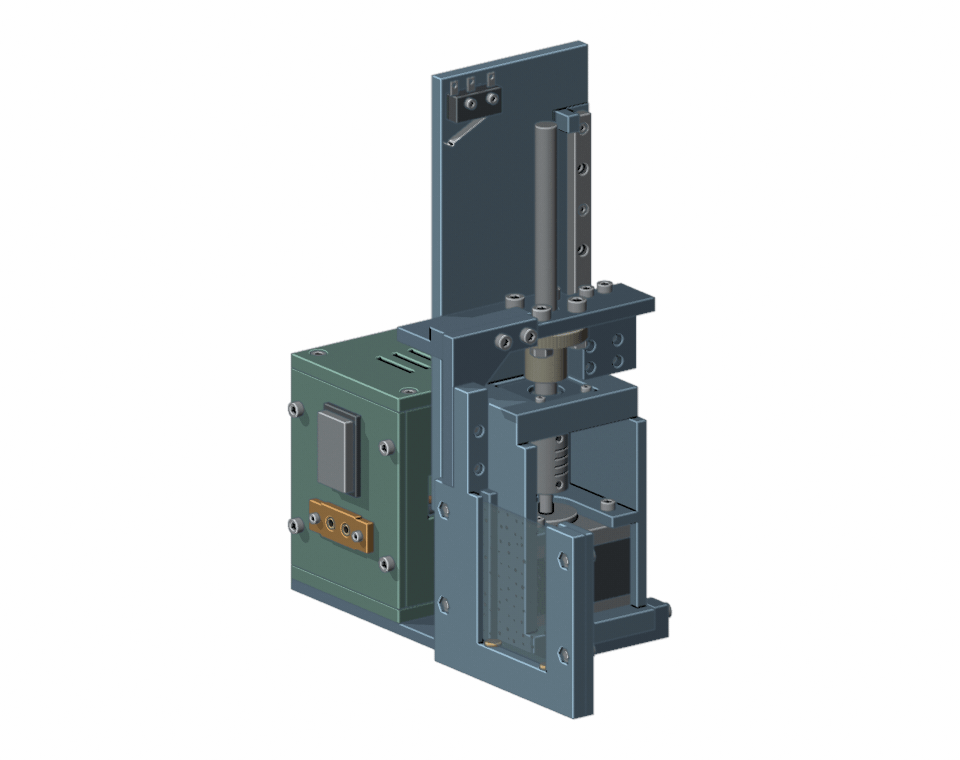

# plate-lift-control

Pololu Tic T825で校正用ガラスプレートを上げ下げします。
設定済みの68 mmストロークの装置向けです。



購入部品を含む3Dモデルの動作イメージです（実機の撮影映像ではありません）。

**[組立・取扱説明書（PDF）](docs/assembly-manual.pdf)** · [購入部材一覧](hardware/bom.md) · **[印刷用STL一式（ZIP）](hardware/print-parts.zip)**

## クイックスタート

### 1. Ticソフトとuvを入れる

すでに入っているものはスキップしてください。

**Mac**

[Pololu公式のTic Software for macOS](https://www.pololu.com/docs/0J71/3.3)をインストールします。
続いてターミナルでuvを入れます。

```bash
curl -LsSf https://astral.sh/uv/install.sh | sh
```

**Windows**

[Pololu公式のTic Software and Drivers for Windows](https://www.pololu.com/docs/0J71/3.1)をインストールします。
続いてPowerShellでuvを入れます。

```powershell
winget install --id=astral-sh.uv -e
```

`winget` がない場合の方法は [uv公式のインストール手順](https://docs.astral.sh/uv/getting-started/installation/)にあります。
インストール後はターミナルまたはPowerShellを開き直してください。

### 2. ダウンロードして準備する

[ZIPをダウンロード](https://github.com/dainakai/plate-lift-control/archive/refs/heads/main.zip)して展開し、`plate-lift-control-main` フォルダを「ダウンロード」に置きます。

Mac：

```bash
cd ~/Downloads/plate-lift-control-main
uv sync
```

Windows：

```powershell
cd "$env:USERPROFILE\Downloads\plate-lift-control-main"
uv sync
```

Pythonとライブラリはuvが準備します。初回はインターネット接続が必要です。

### 3. 上げる／下げる

装置をパソコンへUSB接続し、モーター用のDC電源を接続します。
**DC電源は24 V以下に設定してください。直流安定化電源の最大電圧が21.2 VでもOKです。**
Tic Control Centerが起動中なら閉じてください（[Windowsでは同時にUSB接続できません](https://www.pololu.com/docs/0J71/4.4)）。
以下はMacとWindowsで共通です。必要なほうを実行します。

上げる：

```text
uv run platectl up
```

下げる：

```text
uv run platectl down
```

**普段の操作で、Tic Control Centerを開いてApply settingsを行う必要はありません。**
Ticに保存済みの設定を使います。位置が不明な場合は、指定した側の端を自動で探して停止します。

## その他の操作

| 目的 | コマンド |
| --- | --- |
| 状態を見る | `uv run platectl status` |
| 下端の原点復帰をやり直す | `uv run platectl home` |
| 下げて片付ける | `uv run platectl shutdown` |
| JSONで状態を読む | `uv run platectl status --json` |

通常移動の速度は `150000000`（約14.06 mm/s）です。

## 実験に組み込む

[撮影サンプル](examples/capture_sequence.py)は「上げて校正 → 下げて撮影 → 下端で終了」の流れです。
`capture_calibration()` と `capture_sample()` にカメラの取得処理を入れて使います。
[実行方法とオプション](docs/reference.md#実験スクリプトから使う)

## 必要なときに読む

- [組立・取扱説明書（PDF）](docs/assembly-manual.pdf)／[編集用PowerPoint](docs/assembly-manual.pptx) — 最終更新日：2026年9月15日
- [購入部材一覧](hardware/bom.md)／[CSV](hardware/bom.csv)
- [印刷用STL一式（14部品・ZIP）](hardware/print-parts.zip)／[個別STL](hardware/stl/)／[印刷方法](hardware/printing.md)
- [はめ合い確認用の試験片（ZIP）](hardware/fit-coupons.zip)
- [操作、実験連携、更新の詳細](docs/reference.md)
- [困ったとき](docs/troubleshooting.md)
- [Ticを交換または初期化したときの設定](docs/tic-setup.md)
- [検証範囲](docs/validation.md)／[変更履歴](CHANGELOG.md)／[MIT License](LICENSE)
